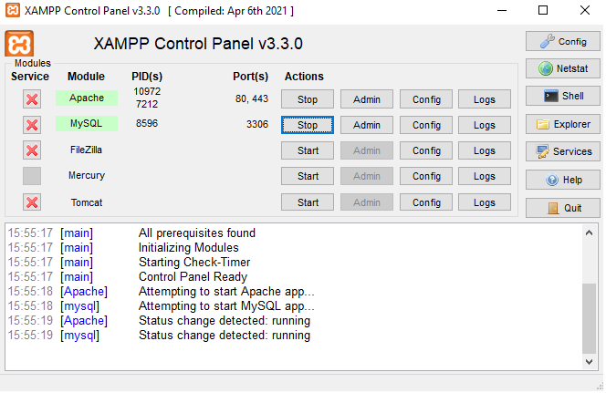

## Sobre o projeto

Este projeto é um exercício proposto com o intuito de desenvolver uma CRUD simples utilizando Laravel 9.x

## Como rodar o projeto

Após baixar o repositório, para rodar o projeto, primeiro precisamos utilizar o XAMPP Control Painel com o Apache e MySQL iniciados.

Em seguida, abrir o terminal no diretório do projeto e executar o comando: php artisan serve

image.png

Acessando então a URL para o localhost, você terá acesso a tela inicial do projeto.

image.png

## Navegando sobre o projeto

image.png

Esta é a tela inicial do projeto, ao clicar em "Go to CRUD", você terá acesso a CRUD desenvolvida neste projeto.(obs: lembre-se de estar com o apache e o mysql)

image.png

### Adicionando povo candidato

Ao clicar em "Add Novo Candidato", você será redirecionado para o forms onde preencherá as informações referentes ao candidato.

image.png

Ao selecionar o estado, as cidades do referente estado aparecerão no select de cidade abaixo:

image.png

Preenchido e adicionado, o candidato será enviado para o BD, onde será listado no index:

image.png

image.png

### Ver candidato

Ao clicar em "See", você será redirecionado para a página do candidato onde serão mostrados os dados referentes ao mesmo.

image.png

### Editando candidato

Ao clicar em editar, você será redirecionado para o forms no qual poderá atualizar os dados referentes ao candidato escolhido.

image.png

Pós atualizado, o participante terá seus dados modificados e listados novamente no index.

image.png

### Excluindo candidato

Ao clicar em "Delete", o candidato será excluido do registro do BD e consequentemente, da lista.

image.png

Confirmar delete:

image.png

Nova lista de candidatos pós exclusão.

image.png

### Observações

Tanto na lista do index como após clicar em "See", os botões para "Edit" ou "Delete" estão disponíveis, assim como "Back" caso você deseje voltar ou "Cancel", caso queira cancelar a edição.