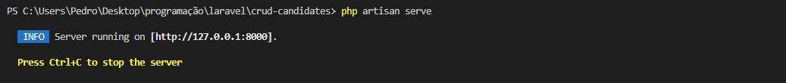

## Sobre o projeto

Este projeto é um exercício proposto com o intuito de desenvolver uma CRUD simples utilizando Laravel 9.x

## Como rodar o projeto

Após baixar o repositório, para rodar o projeto, primeiro precisamos utilizar o XAMPP Control Painel com o Apache e MySQL iniciados.

Em seguida, abrir o terminal no diretório do projeto e executar o comando: php artisan serve

Acessando então a URL para o localhost, você terá acesso a tela inicial do projeto.

## Navegando sobre o projeto

Ao clicar em "Go to CRUD", você terá acesso a CRUD desenvolvida neste projeto.(obs: lembre-se de estar com o apache e o mysql)

### Adicionando povo candidato

Ao clicar em "Add New Candidate", você será redirecionado para o forms onde preencherá as informações referentes ao candidato.

Ao selecionar o estado, as cidades do referente estado aparecerão no select de cidade abaixo:

Preenchido e adicionado, o candidato será enviado para o BD, onde será listado no index:

### Ver candidato

Ao clicar em "See", você será redirecionado para a página do candidato onde serão mostrados os dados referentes ao mesmo.

### Editando candidato

Ao clicar em editar, você será redirecionado para o forms no qual poderá atualizar os dados referentes ao candidato escolhido.

Pós atualizado, o participante terá seus dados modificados e listados novamente no index.

### Excluindo candidato

Na imagem acima, o botão "Delete" está disponível para excluir o candidato, o candidato será excluido do registro do BD e consequentemente, da lista.

Confirmar delete:

Nova lista de candidatos pós exclusão.

### Observações

Tanto na lista do index como após clicar em "See", os botões para "Edit" ou "Delete" estão disponíveis, assim como "Back" caso você deseje voltar ou "Cancel", caso queira cancelar a edição.